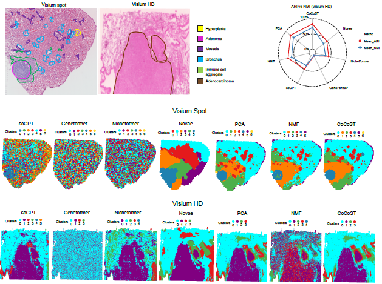

# STFoundation-vs-Classical
This repository contains code for systematic comparison of foundation models and classical feature representation methods for spatial transcriptomics analysis. We evaluate scGPT, Geneformer, Nicheformer and Novae, against classical methods such as PCA, NMF and CoCo-ST across core spatial transcriptomics tasks, including spatial domain and niche detection, robustness to noise and resolution changes, trajectory inference and recovery of interpretable transcriptional programs.

  

### Support
For questions, feature requests, or bug reports, please open a new issue in this repository. Providing clear descriptions and, when possible, minimal reproducible examples will help us respond more efficiently.

### Contributions
We welcome contributions, suggestions, and constructive feedback from the community.

### Model Configuration
All foundation models in this comparative analysis are run using the default parameter settings recommended by the original authors, as specified in their official tutorials or documentation.
No task-specific hyperparameter tuning is performed unless explicitly stated. This design choice ensures a fair and reproducible comparison across models.

### Citation
If you use this repository or find it helpful, please cite the corresponding manuscript:

Aminu M. et al. Large foundation models do not yet outperform classical linear methods in spatially resolved transcriptomics.

A preprint and DOI will be added upon acceptance.
